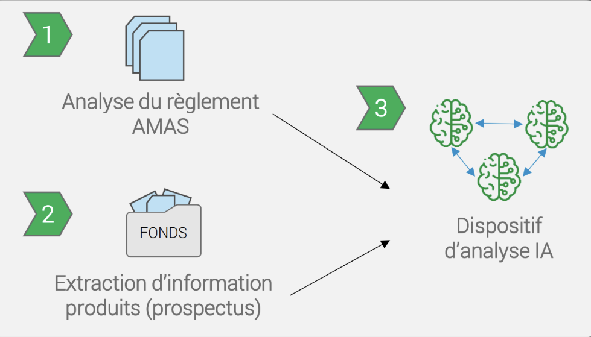

# Azure Hackathon 2026: ESG Fund Analysis Challenge

Welcome to the **Microsoft Azure Hackathon 2026**! This repository contains everything you need to participate in our AI-powered ESG (Environmental, Social, and Governance) fund analysis challenge.


## 📋 Table of Contents
- [Challenge Overview](#-challenge-overview)
- [Hackathon Structure & Collaboration](#-hackathon-structure--collaboration)
- [Resources & Starter Solution](#-resources--starter-solution)
- [Three-Challenge Pipeline Architecture](#-three-challenge-pipeline-architecture)
- [Recommended Azure Services](#-recommended-azure-services)
- [Bonus: Visualization & UI](#-bonus-visualization--ui)

## 🎯 Challenge Overview

### Business Context

The Asset Management (AM) team analyzes fund prospectuses every year—long, heterogeneous, and unstructured documents—to evaluate the ESG characteristics of financial products. However, this process faces significant challenges:

- **Information is scattered** across documents that are hundreds of pages long
- **Document structures vary significantly** from one fund to another
- **Sustainability criteria must be evaluated** against the Asset Management Association Switzerland (AMAS) regulations

### The Goal

**Automate the ESG analysis of financial products** from prospectuses by systematically comparing them against AMAS requirements.

### Scope

- **11 PDF documents**: 10 fund prospectuses + 1 AMAS regulation document. You can find them in the [data/](../../data/) folder.
- **Multiple languages**: English, French, or German
- **One product per document** to be analyzed
- **26 questions** to answer for each product

Example questions:
- Can the fund be qualified as "Best-in-Class"?
- Are there KPIs used to measure the fund's sustainability?
- Can the fund be qualified as "sustainable"?

Expected answers (Yes/No) will be provided for each question and fund to validate your solutions.

## 👥 Hackathon Structure & Collaboration

### Timeline

**Monday, January 19**
- 08:30 – Welcome and get to know
- 09:00 – Kick-off & theory primer
- 11:00 – Challenge presentation & Q&A
- 11:30 – Team Formation
- 12:00 – Lunch Break
- 13:00 – Hands-on Challenges

**Tuesday, January 20**
- 08:30 – Continue Development (Challenges I & II)
- 13:00 – Hands-on Challenge III (Work in pairs)
- 16:00 – Final Presentations
- 17:00 – Hackathon Ends

### Working Groups

- **Day 1:** Two groups of five participants work on AMAS analysis and source data preprocessing
- **Day 2:** Pairs work on integrating outputs into the intelligent retrieval and evaluation


## 📚 Resources & Starter Solution

This repository provides a complete "Chat with your data" solution using Azure OpenAI and Azure AI Search. You can use it as a foundation or inspiration for your hackathon challenges.

- **[Starter Solution Guide](../../README.md)**: The main entry point for setting up, deploying, and running the base RAG application.
- **[Documentation](../)**: Detailed guides on data ingestion, retrieval, and deployment strategies.


## 🏗️ Three-Challenge Pipeline Architecture


### [Challenge 1: AMAS Regulation Analysis](challenges/challenge-1-amas-analysis.md)

**Objective:** Extract relevant rules from the AMAS regulation for each question and reformulate them into clear, AI-exploitable language.

**Inputs:**
- AMAS self-regulation document
- An AMAS question

**Output:**
A structured object containing:
- The question identifier and text.
- A clear summary of the regulation context relevant to that question.

### [Challenge 2: Source Data Preprocessing (Prospectus)](challenges/challenge-2-data-preprocessing.md)

**Objective:** Automatically identify and extract relevant sections from a prospectus that describe a given product.

**Inputs:**
- Fund prospectus (PDF)
- Product name

**Output:**
A structured data set containing:
- The document and product identifiers.
- Extracted text segments relevant to the product and query.
- Metadata such as page numbers or section headers.

### [Challenge 3: Intelligent Retrieval and Evaluation (Final Analysis)](challenges/challenge-3-intelligent-retrieval.md)

**Objective:** Cross-reference the regulatory context and product context to produce a justified and traceable answer to each AMAS question.

**Inputs:**
- AMAS JSON (from Challenge 1)
- Product JSON (from Challenge 2)
- Target question

**Output:**
```json
{
  "question_id": 12,
  "answer": false,
  "reasoning": "The prospectus describes a general ESG approach, but does not mention [...], as required by AMAS for a Best-in-Class qualification.",
  "sources": [
    {
      "page": 42,
A final compliance assessment containing:
- The answer (Yes/No).
- Detailed reasoning justifying the answer based on the rules and facts.
- Citations linking back to specific parts of the source document.-------|---------|
| **Azure OpenAI** | Essential for chat functionality; useful for vision and embedding capabilities |
| **Azure AI Search** | Required for RAG (Retrieval-Augmented Generation); useful for document preprocessing |
| **Azure Storage Account / Azure Blob Storage** | Necessary for storing raw PDF files |

### Should-Have Services

| Service | Purpose |
|---------|---------|
| **Azure Text Analytics** | Useful for testing off-the-shelf document preprocessing features |
| **Azure Document Intelligence** | Useful for testing off-the-shelf document preprocessing features |
| **Azure Functions** | Useful for learning how to create APIs and microservices on Azure |

## 🎨 Bonus: Visualization & UI

You can find a starter frontend application in the [app/hackathon-frontend/](../../app/hackathon-frontend/) folder.

Optional high-value features:
- Drag & drop prospectus upload
- PDF visualization with interactive display
- Highlighting passages used to answer specific questions
- Visual comparison of multiple products on the same ESG question


**Good luck, and happy hacking! 🎉**
