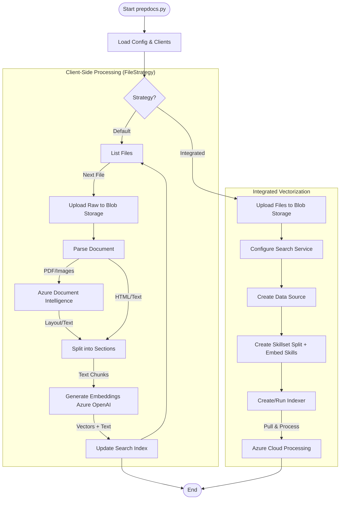

# Document Preparation and Ingestion

The `app/backend/prepdocs.py` script is the core engine for ingesting documents into the RAG (Retrieval-Augmented Generation) system. It orchestrates the process of reading files, parsing them, chunking them into retrieval-friendly sections, generating vector embeddings, and indexing them into Azure AI Search.

## Strategies

The script supports two primary ingestion strategies:

### 1. Client-Side Processing (Default)
This strategy runs locally (or in the environment executing the script) using `prepdocslib.filestrategy.FileStrategy`. The Python code handles every step of the pipeline: parsing, splitting, and embedding. This offers maximum control over how documents are processed.

#### Handling PDFs with Client-Side Strategy

The handling of PDF files depends on the configuration of the **Azure Document Intelligence** service and the script arguments. This logic is centrally managed in `app/backend/prepdocslib/servicesetup.py` and `app/backend/prepdocslib/pdfparser.py`.

**Selection Logic:**
The script decides which parser to use for `.pdf` files based on the following precedence:
1.  **Local Parser (PyPDF)**: specificed if the `--localpdfparser` flag is used OR if no Azure Document Intelligence service is configured (`AZURE_DOCUMENTINTELLIGENCE_SERVICE` env var is missing).
    *   **Class**: `LocalPdfParser`
    *   **Implementation**: Uses the `pypdf` Python library to extract text directly from the PDF stream. Use this for simple, text-heavy PDFs where layout analysis is not critical.
2.  **Azure Document Intelligence**: Used if an Azure Document Intelligence service *is* available AND the local parser is *not* forced.
    *   **Class**: `DocumentAnalysisParser`
    *   **Implementation**: Uses the Azure SDK to classify the document using the **prebuilt-layout** model.

**Document Intelligence Configuration:**
When Document Intelligence is active, the `DocumentAnalysisParser` is initialized with specific parameters to optimize for RAG:

*   **Model ID**: uses `prebuilt-layout`. This model is chosen because it extracts structure (paragraphs, headings) and tables, which are crucial for maintaining semantic meaning during chunking.
*   **Multimodal Support (Figures)**: If multimodal support is enabled (via `--multimodal` flag or `USE_MULTIMODAL` env var), the parser requests additional features:
    *   `output=["figures"]`: Tells the service to detect and bound figures (charts, diagrams, images).
    *   `features=["ocrHighResolution"]`: Enhances recognition quality.
    *   `output_content_format="markdown"`: Requests the analysis result in Markdown format, which naturally represents structure.
*   **Reconstruction**: The parser doesn't just take the raw text. It intelligently reconstructs the page content:
    *   **Tables**: Detected tables are converted to HTML (`<table>...</table>`) and inserted into the text flow at their visual position.
    *   **Figures**: If enabled, figures are cropped from the original PDF using `pymupdf` (based on bounding boxes returned by Azure), and replaced in the text with placeholder markers.

**Other Formats**:
If Document Intelligence is enabled, it is also automatically used to parse other complex formats like office documents (`.docx`, `.pptx`, `.xlsx`) and images (`.png`, `.jpg`, etc.), providing a unified ingestion capability.

### 2. Integrated Vectorization (Server-Side)
This strategy offloads the processing to Azure AI Search using `prepdocslib.integratedvectorizerstrategy.IntegratedVectorizerStrategy`. Files are uploaded to Azure Blob Storage, and an Azure AI Search "Indexer" with a "Skillset" automatically chunks and embeds the data in the cloud.

## Detailed Workflow (Client-Side)

1.  **File Discovery**: The script identifies files to process. This can be from a local folder (`LocalListFileStrategy`) or an existing Azure Data Lake Gen2 container (`ADLSGen2ListFileStrategy`).
2.  **Raw File Upload**: The original source files are uploaded to Azure Blob Storage `content` container. This ensures the frontend can display citations links back to the original source.
3.  **Parsing**: Specialised parsers in `prepdocslib/` extract text and images based on file type:
    *   **PDFs**: Parsed using `PdfParser`. This can use either the local `pypdf` library or the **Azure Document Intelligence** service (formerly Form Recognizer) for high-fidelity extraction (tables, layout).
    *   **HTML/Text/Markdown**: Parsed using `HtmlParser` or `TextParser`.
    *   **Images/Figures**: If multimodal support is enabled, `FigureProcessor` extracts images from PDFs and generates descriptions using Azure OpenAI (GPT-4o) or embeddings.
4.  **Splitting**: Large documents are split into smaller chunks (pages or sections) using `TextSplitter`. This is crucial for retrieval accuracy, ensuring that search results are focused and fit within the LLM's context window.
5.  **Embedding**: Each chunk is sent to **Azure OpenAI's text-embedding models** (e.g., `text-embedding-ada-002`) to generate a vector representation.
6.  **Indexing**: Finally, the text content, metadata, and vector embeddings are pushed to the **Azure AI Search** index.

## Ingestion Flow Diagram



## Key Components (`app/backend/prepdocslib/`)

*   **`fileprocessor.py`**: Factory that assigns the correct parser (PDF, HTML, etc.) to a file.
*   **`textsplitter.py`**: Logic for breaking large text blocks into overlapping sentences or pages.
*   **`embeddings.py`**: Wrapper for calling the Azure OpenAI Embeddings API.
*   **`searchmanager.py`**: Handles connection to Azure AI Search, creating indexes, and uploading documents.
*   **`strategy.py`**: Base class defining the interface for ingestion strategies.

## Execution

The script is typically run via the convenience wrapper `scripts/prepdocs.sh` (or `.ps1`), which sets up the Python virtual environment and passes necessary arguments.

```bash
# Example usage via shell script
./scripts/prepdocs.sh --removeall --files "./data/*"
```
